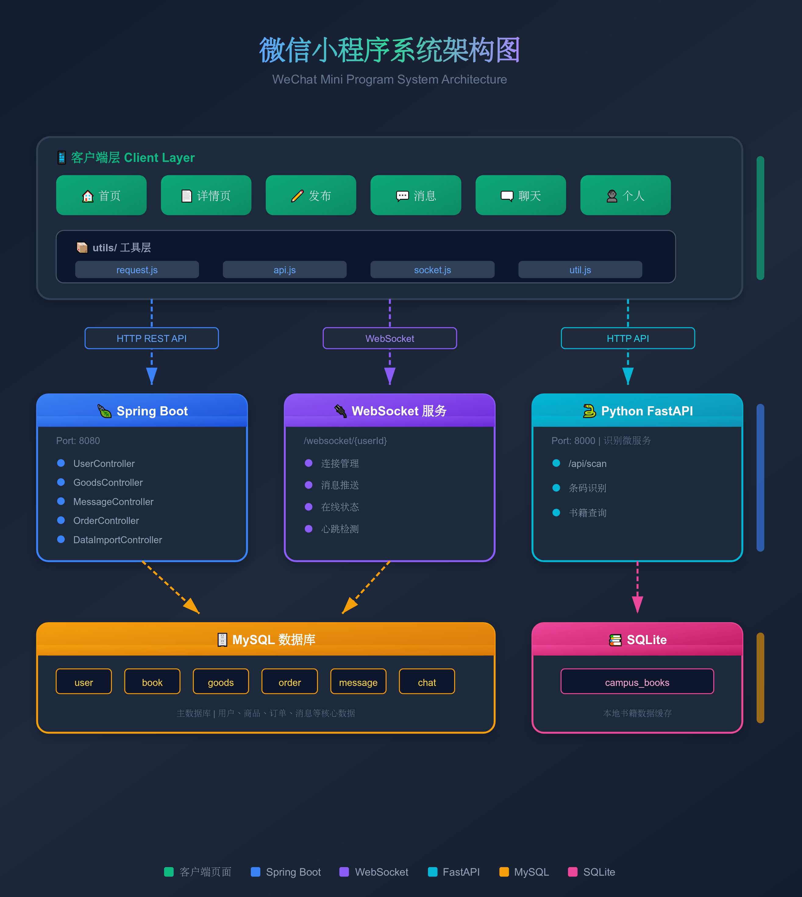

# 📚 校园二手书交易平台 - Campus BookShare

<p align="center">
  
</p>

<p align="center">
  <strong>面向校园场景的大学生二手书交易平台</strong>
</p>

<p align="center">
  
  
  
  
  
</p>

---

## 📋 目录

- [项目简介](#项目简介)
- [功能特性](#功能特性)
- [系统架构](#系统架构)
- [技术栈](#技术栈)
- [项目结构](#项目结构)
- [快速开始](#快速开始)
- [API文档](#api文档)
- [开发指南](#开发指南)
- [部署说明](#部署说明)
- [常见问题](#常见问题)
- [更新日志](#更新日志)
- [贡献指南](#贡献指南)

---

## 📖 项目简介

**Campus BookShare** 是一个专为大学生设计的二手书交易平台，旨在解决校园内教材流转效率低、信息不对称的问题。通过微信小程序提供便捷的发布、搜索、交易和沟通功能。

### 🎯 解决的问题

| 痛点 | 解决方案 |
|------|---------|
| 教材昂贵，使用周期短 | 二手书交易，节省开支 |
| 找书困难，信息分散 | 按校区/专业/课程筛选 |
| 交易沟通不便 | 实时WebSocket聊天 |
| 手动输入书籍信息繁琐 | ISBN扫码/拍照智能识别 |

---

## ✨ 功能特性

### 📱 小程序端功能

| 模块 | 功能 | 状态 |
|------|------|------|
| **首页** | 书籍列表、多维度筛选(校区/专业/排序)、下拉刷新 | ✅ 已完成 |
| **详情页** | 图片轮播、商品信息、卖家信息、收藏/联系/购买 | ✅ 已完成 |
| **发布** | ISBN扫码识别、拍照OCR识别、多图上传、智能定价 | ✅ 已完成 |
| **消息** | 消息列表、未读提示、实时聊天(WebSocket) | ✅ 已完成 |
| **个人中心** | 微信登录、我的发布、学生认证、设置 | ✅ 已完成 |

### 🖥️ 后端服务功能

| 模块 | 功能 | 状态 |
|------|------|------|
| **用户管理** | 微信登录、JWT认证、学生认证 | ✅ 已完成 |
| **商品管理** | CRUD、分页查询、状态管理 | ✅ 已完成 |
| **消息系统** | REST API + WebSocket实时推送 | ✅ 已完成 |
| **订单系统** | 订单创建、状态流转 | ✅ 已完成 |
| **数据导入** | JSON/Excel批量导入 | ✅ 已完成 |
| **文件上传** | 图片上传存储 | ✅ 已完成 |

### 🐍 Python识别服务

| 功能 | 说明 | 状态 |
|------|------|------|
| **ISBN条码识别** | 支持EAN-13条码扫描 | ✅ 已完成 |
| **二维码识别** | 支持QR Code解析 | ✅ 已完成 |
| **书籍信息查询** | 本地SQLite书籍库匹配 | ✅ 已完成 |
| **结果持久化** | 识别结果JSON保存 | ✅ 已完成 |

---

## 🏗️ 系统架构



---

## 🛠️ 技术栈

### 前端 (微信小程序)

| 技术 | 版本 | 说明 |
|------|------|------|
| 微信小程序框架 | - | 原生开发 |
| WXML/WXSS | - | 模板与样式 |
| JavaScript | ES6+ | 业务逻辑 |
| WebSocket | - | 实时通信 |

### 后端 (Java)

| 技术 | 版本 | 说明 |
|------|------|------|
| Spring Boot | 2.7.18 | 基础框架 |
| MyBatis Plus | 3.5.3.1 | ORM框架 |
| MySQL | 8.0+ | 主数据库 |
| JWT | 0.9.1 | 身份认证 |
| WebSocket | - | 实时消息 |
| FastJSON2 | 2.0.40 | JSON处理 |
| Hutool | 5.8.20 | 工具库 |
| Apache POI | 5.2.3 | Excel处理 |

### 识别服务 (Python)

| 技术 | 版本 | 说明 |
|------|------|------|
| Python | 3.8+ | 运行环境 |
| FastAPI | latest | Web框架 |
| OpenCV | headless | 图像处理 |
| pyzbar | latest | 条码解析 |
| SQLite | 3 | 本地书籍库 |

---

## 📁 项目结构

```
campus-bookshare/
├── 📂 miniprogram/                    # 微信小程序前端
│   ├── 📂 pages/                      # 页面目录
│   │   ├── 📂 index/                  # 首页
│   │   │   ├── index.js
│   │   │   ├── index.json
│   │   │   ├── index.wxml
│   │   │   └── index.wxss
│   │   ├── 📂 detail/                 # 商品详情页
│   │   ├── 📂 publish/                # 发布页
│   │   ├── 📂 message/                # 消息列表页
│   │   ├── 📂 chat/                   # 聊天详情页 ⭐新增
│   │   ├── 📂 profile/                # 个人中心
│   │   └── 📂 login/                  # 登录页
│   ├── 📂 utils/                      # 工具类
│   │   ├── request.js                 # HTTP请求封装
│   │   ├── api.js                     # API接口定义
│   │   ├── socket.js                  # WebSocket封装 ⭐新增
│   │   └── util.js                    # 通用工具函数
│   ├── 📂 images/                     # 图片资源
│   ├── app.js                         # 全局逻辑
│   ├── app.json                       # 全局配置
│   └── app.wxss                       # 全局样式
│
├── 📂 backend/                        # Spring Boot后端
│   ├── 📂 src/main/
│   │   ├── 📂 java/com/campus/bookshare/
│   │   │   ├── 📂 controller/         # 控制器
│   │   │   │   ├── UserController.java
│   │   │   │   ├── GoodsController.java
│   │   │   │   ├── DataImportController.java
│   │   │   │   └── OtherControllers.java
│   │   │   ├── 📂 service/            # 服务层
│   │   │   │   ├── UserService.java
│   │   │   │   ├── GoodsService.java
│   │   │   │   ├── BookService.java
│   │   │   │   └── 📂 impl/
│   │   │   ├── 📂 mapper/             # 数据访问层
│   │   │   ├── 📂 entity/             # 实体类
│   │   │   ├── 📂 dto/                # 数据传输对象
│   │   │   ├── 📂 common/             # 通用类
│   │   │   ├── 📂 config/             # 配置类 ⭐新增
│   │   │   │   └── WebSocketConfig.java
│   │   │   ├── 📂 socket/             # WebSocket ⭐新增
│   │   │   │   └── WebSocketServer.java
│   │   │   └── 📂 util/               # 工具类
│   │   └── 📂 resources/
│   │       ├── 📂 mapper/             # MyBatis XML
│   │       └── application.yml        # 配置文件
│   └── pom.xml                        # Maven配置
│
├── 📂 CodeDetection/                  # Python识别服务 ⭐新增
│   ├── CodeDetection.py               # FastAPI主服务
│   ├── init_db.py                     # 数据库初始化
│   ├── requirements.txt               # Python依赖
│   ├── campus_books.db                # 书籍数据库
│   └── 📂 scan_results/               # 识别结果保存
│
├── 📂 database/                       # 数据库脚本
│   └── init.sql                       # MySQL初始化
│
├── 📂 docs/                           # 文档
│   ├── STARTUP_GUIDE.md               # 启动指南
│   ├── DATABASE_INTEGRATION.md        # 数据库集成说明
│   └── FIX_LOGBYJSQ.md               # 修复日志
│
└── README.md                          # 项目说明
```

---

## 🚀 快速开始

### 环境要求

| 环境 | 版本要求 | 说明 |
|------|---------|------|
| JDK | 1.8+ | Java运行环境 |
| Maven | 3.6+ | 依赖管理 |
| MySQL | 8.0+ | 主数据库 |
| Node.js | 14+ | (可选) |
| Python | 3.8+ | 识别服务 |
| 微信开发者工具 | 最新版 | 小程序开发 |

### 第一步：数据库初始化

```bash
# 1. 登录MySQL
mysql -u root -p

# 2. 执行初始化脚本
source /path/to/campus-bookshare/database/init.sql
```

也可以直接创建数据库并导入初始数据

```bash
mysql -u root -p < database/init.sql
```

### 第二步：启动Spring Boot后端

```bash
# 1. 进入后端目录
cd backend

# 2. 修改配置文件
# 编辑 src/main/resources/application.yml
spring:
  datasource:
    url: jdbc:mysql://localhost:3306/campus_bookshare?useUnicode=true&characterEncoding=utf-8&useSSL=false&serverTimezone=Asia/Shanghai
    username: your_username
    password: your_password
# 修改数据库连接信息

# 3. 编译运行
mvn clean compile
mvn spring-boot:run
```

验证：访问 http://localhost:8080/api 应返回成功

### 第三步：启动Python识别服务

```bash
# 1. 进入识别服务目录
cd CodeDetection

# 2. 创建虚拟环境 (推荐)
python -m venv venv
source venv/bin/activate  # Linux/Mac
venv\Scripts\activate     # Windows

# 3. 安装依赖
pip install -r requirements.txt

# 4. 初始化书籍数据库
python init_db.py

# 5. 启动服务
python CodeDetection.py
```

验证：访问 http://localhost:8000/docs 查看API文档

### 第四步：启动微信小程序

1. 打开微信开发者工具
2. 导入 `miniprogram` 目录
3. 修改 `app.js` 中的 `baseUrl`
4. 编译运行

---

## 📡 API文档

### 用户接口

| 方法 | 路径 | 说明 |
|------|------|------|
| POST | `/user/login/wechat` | 微信登录 |
| GET | `/user/info` | 获取用户信息 |
| POST | `/user/updateUserInfo` | 更新用户信息 |
| POST | `/user/certify` | 学生认证 |

### 商品接口

| 方法 | 路径 | 说明 |
|------|------|------|
| GET | `/goods/list` | 商品列表(分页) |
| GET | `/goods/detail/{id}` | 商品详情 |
| POST | `/goods/publish` | 发布商品 |
| GET | `/goods/my` | 我的商品 |
| PUT | `/goods/{id}/status` | 更新状态 |
| DELETE | `/goods/{id}` | 删除商品 |

### 消息接口

| 方法 | 路径 | 说明 |
|------|------|------|
| GET | `/message/list` | 消息列表 |
| GET | `/message/conversation/{userId}` | 获取对话 |
| POST | `/message/send` | 发送消息 |

### WebSocket接口

```
连接地址: ws://localhost:8080/websocket/{userId}

发送消息格式:
{
  "toUserId": 102,
  "content": "你好，书还在吗？",
  "type": 1
}

接收消息格式:
{
  "fromUserId": 101,
  "content": "在的，什么时候方便？",
  "createTime": "2025-01-01 12:00:00"
}
```

### 识别服务接口

```
POST http://localhost:8000/api/scan
Content-Type: multipart/form-data

请求: file=<图片文件>

响应:
{
  "code": "200",
  "msg": "操作成功",
  "data": [
    {
      "code": "1",
      "bookName": "深入理解计算机系统",
      "author": "Randal E.Bryant",
      "isbn": "9787111544937"
    }
  ]
}
```

---

## 💻 开发指南

### 添加新页面

1. 在 `miniprogram/pages/` 下创建目录
2. 在 `app.json` 的 `pages` 数组中注册
3. 实现页面逻辑

### 添加新接口

1. 在 `api.js` 中定义接口
2. 后端创建对应Controller
3. 实现Service和Mapper

### WebSocket开发

```javascript
// 前端使用示例
const socket = require('../../utils/socket.js');

// 建立连接
socket.connect();

// 监听消息
socket.onMessage((data) => {
  console.log('收到消息:', data);
});

// 发送消息
socket.send({
  toUserId: 102,
  content: '你好',
  type: 1
});

// 关闭连接
socket.close();
```

---

## 🚢 部署说明

### 生产环境配置

```yaml
# application.yml
server:
  port: 8080

spring:
  datasource:
    url: jdbc:mysql://your-db-host:3306/campus_bookshare
    username: your_username
    password: your_password

wechat:
  appid: your_real_appid
  secret: your_real_secret
```

### Docker部署 (可选)

```dockerfile
# 后端Dockerfile
FROM openjdk:8-jdk-alpine
COPY target/bookshare-1.0.0.jar app.jar
ENTRYPOINT ["java","-jar","/app.jar"]
```

### Nginx配置

```nginx
server {
    listen 443 ssl;
    server_name your-domain.com;
    
    # WebSocket代理
    location /websocket/ {
        proxy_pass http://localhost:8080;
        proxy_http_version 1.1;
        proxy_set_header Upgrade $http_upgrade;
        proxy_set_header Connection "upgrade";
    }
    
    # API代理
    location /api/ {
        proxy_pass http://localhost:8080;
    }
    
    # 识别服务代理
    location /scan/ {
        proxy_pass http://localhost:8000;
    }
}
```

---

## ❓ 常见问题

### Q: WebSocket连接失败？

A: 检查以下几点：
1. 确保后端已启动
2. 检查用户是否已登录
3. 开发工具中关闭"不校验合法域名"

### Q: 条码识别失败？

A: 检查以下几点：
1. Python服务是否启动
2. 图片是否清晰
3. 是否为有效ISBN条码

### Q: 数据库连接失败？

A: 检查以下几点：
1. MySQL服务是否启动
2. 用户名密码是否正确
3. 数据库是否已创建

---

## 📝 更新日志

### v1.3.0 

- ✅ 完善ISBN识别功能
- ✅ 实现书籍封面识别功能

### v1.2.0 (订单系统)

- ✅ 完整订单CRUD功能
- ✅ 订单列表/详情页面
- ✅ 订单状态流转
- ✅ 买家/卖家双视角
- ✅ 订单统计

### v1.1.0 (2025-12-16)

**新增功能：**
- ✨ WebSocket实时聊天功能
- ✨ Python条码/二维码识别服务
- ✨ 聊天页面UI

**改进优化：**
- 🔧 消息列表跳转优化
- 🔧 依赖版本更新

### v1.0.0 (2025-12-14)

**初始版本：**
- 📱 微信小程序完整功能
- 🖥️ Spring Boot后端服务
- 📊 数据导入功能

---

## 🤝 贡献指南

1. Fork 本项目
2. 创建特性分支 (`git checkout -b feature/AmazingFeature`)
3. 提交更改 (`git commit -m 'Add some AmazingFeature'`)
4. 推送分支 (`git push origin feature/AmazingFeature`)
5. 创建 Pull Request

---

## 📄 许可证

MIT License - 详见 [LICENSE](LICENSE)

---

## 👥 开发团队

| 角色 | 职责 |
|------|------|
| 项目负责人 | 架构设计、代码审核 |
| 后端开发 | Spring Boot、数据库 |
| 前端开发 | 微信小程序 |
| 算法开发 | Python识别服务 |

---

<p align="center">
  <strong>🎓 Campus BookShare - 让知识流动起来</strong>
</p>

<p align="center">
  Made with ❤️ by Campus BookShare Team
</p>
